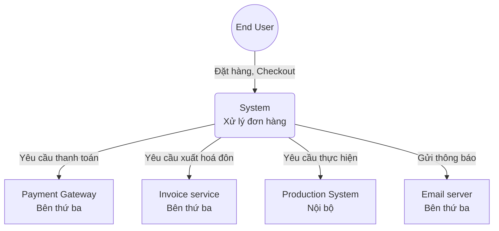
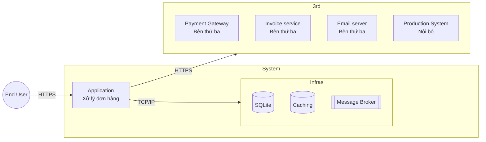
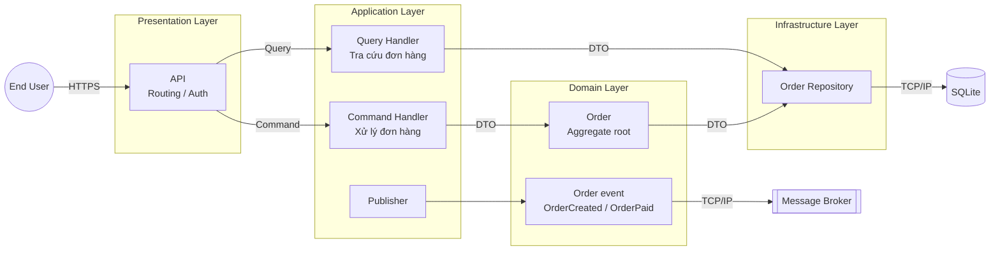
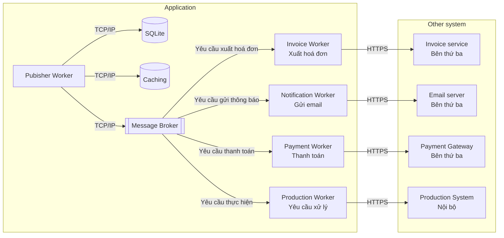
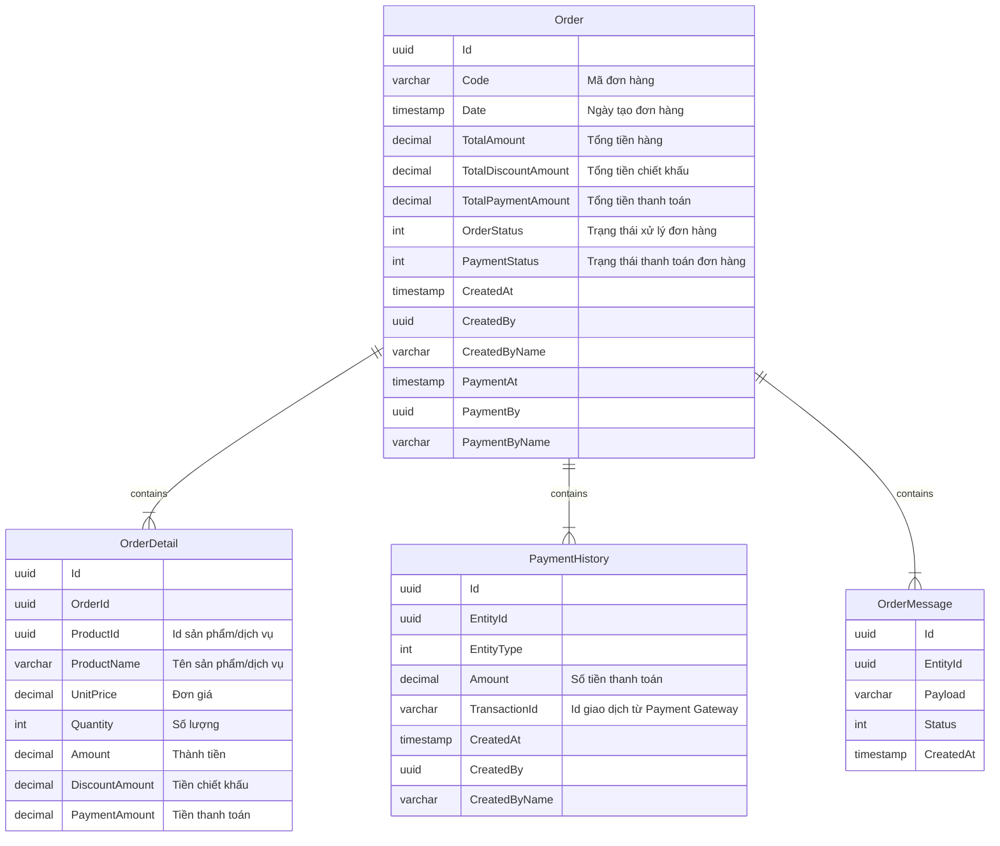

# SAD OrderService

## 1. Requirement

Khách hàng cần thực hiện thanh toán đơn hàng đã được tạo trước để đẩy đơn hàng đó sang hệ thống Production.
Khi một đơn hàng được checkout thành công, hệ thống cần gửi email cho khách hàng để thông báo rằng việc này đã thành công. Đồng thời, tạo một hóa đơn trong hệ thống hóa đơn; sau đó, cần gọi hệ thống Production nội bộ (Production service) để đẩy đơn hàng này vào xử lý trong hệ thống nội bộ.

Giả định:
1. Bài toán là dạng bán dịch vụ, nên ko yêu cầu kiểm tra tồn kho khi tạo đơn hàng
1. Hệ thống có ~500k đơn hàng trong database của 1k khách hàng
1. Mỗi ngày phát sinh 1k đơn hàng
1. Có 500 khách hàng cùng tra cứu đơn hàng đồng thời. Peak concurrent users là 1000
1. Có 50 khách hàng cùng thanh toán đồng thời. Peak concurrent users 500 giao dịch

Yêu cầu chức năng:
1. Đơn hàng có thể được tìm kiếm/lọc theo tên
1. Nếu đơn hàng được checkout thành công, cần gọi hệ thống nội bộ (Production system) để cập nhật trạng thái của đơn hàng trong hệ thống nội bộ
1. Khách hàng phải nhận được email nếu thanh toán thành công
1. Khách hàng sau khi checkout thành công sẽ nhận dc mail thông báo dưới 1 phút (ko bao gồm thời gian gửi mail)

## 2. Decision

### 2.1. Công nghệ
- **Database**: SQLite. Phù hợp với mục đích demo, đáp ứng tính chất ACID. Có thể migrate sang các loại DB SQL khác như MySQL, Postgresql, MSSQL, ...
- **ORM**: Entity Framework. Native với .Net, tương thích với đa số các loại DB SQL phổ biến
- **Caching**: InMemory. Phù hợp với mục đích demo, sử dụng thư viện ... dễ dàng switch sang Distributed Cache như Redis
- **Message Broker**: InMemory. Phù hợp với mục đích demo, sử dụng thư viện ... 
- **Backend Framework**: .Net Core MVC. Phù hợp để làm microservices, đầy đủ các tính năng cơ bản như: Routing, Authorization, Authentication, Middlewares, JSON, ...
- **Frontend Framework**: ReactJS. Phổ biến nhất hiện tại
- **API Gateway**: Ko sử dụng, để đơn giản hoá khi làm demo

### 2.2. Kiến trúc
- **Microservices**: Chia service làm 2 thành phần API và worker publisher có thể triển khai, scale riêng; giao tiếp với Payment Gateway, Invoice, email và Production qua API, phù hợp scale từng thành phần khi tải tăng hoặc bài toán mở rộng.
- **Clean Architecture**: Tuân thủ các nguyên tắc giảm sự phụ thuộc. Phân tầng Host (presentation), Application (use case / CQRS handlers), Domain (entity, rule), Infrastructure (EF, message broker, cache) với luồng phụ thuộc hướng vào trong: Application và Domain không phụ thuộc chi tiết triển khai framework hay DB.
- **Domain Driven Design**: Thiết kế Order chứa toàn bộ nghiệp vụ của service, Order là aggregate root xử lý nghiệp vụ, lưu trữ event cho publisher gửi đến broker.

### 2.3. C4

#### Level 1: Context

`OrderService` đóng vai trò trung tâm, nhận yêu cầu từ người dùng, xử lý đơn hàng, sau đó giao tiếp với các hệ thống khác thông qua API. Đảm bảo tính độc lập theo kiến trúc microservice

#### Level 2: Container

#### Level 3: Component

`OrderService` gồm 2 thành phần chính: API và Pubisher
- **API**: Tiếp nhận yêu cầu từ end user, giao tiếp với database để thực hiện tra cứu, khởi tạo, thanh toán đơn hàng
- **Pubisher**: Sử dụng outbox pattern để đảm bảo các nghiệp vụ thanh toán, thông báo, sản xuất tiếp nhận và xử lý dc yêu cầu

##### 1. OrderAPI

`OrderAPI` áp dụng `Domain Driven Design` với các thành phần
- **API**: Tiếp nhận request, thực hiện authentication trước khi routing đến controller, action tương ứng
- **Command handler**: Tiếp nhận và xử lý các lệnh (command) tạo đơn hàng, thanh toán đơn hàng
- **Query handler**: Tiếp nhận và xử lý các truy vấn (query) tra cứu đơn hàng
- **Order**: Chứa business logic như lưu đơn hàng, cập nhật trạng thái đơn hàng
- **Order events**: Chứa các events để trigger gửi email, thanh toán, sản xuất
- **Order repository**: Lớp giao tiếp trực tiếp với database
- **Database**: Lưu trữ đơn hàng và message
- **MessageBroker**: Lưu trữ event

##### 2. OrderPubisher

`OrderPubisher` áp dụng `Outbox message pattern` với các thành phần
- **Pubisher worker**: Định kỳ scan bảng OrderOutboxMessage, lọc ra các message chưa xử lý để gửi lại vào message broker
- **Payment worker**: Nhận event OrderProcessPayment và call API Payment Gateway để thực hiện thanh toán
- **Invoice worker**: Nhận event OrderPaid và call API Invoice Service để thực hiện xuất hoá đơn
- **Notification worker**: Nhận event OrderPaid và call API EmailServer để gửi thông báo
- **Production worker**: Nhận event OrderPaid và call API ProductionSystem để gửi yêu cầu thực hiện đơn hàng
- **Database**: Lưu trữ đơn hàng và message
- **Caching**: Lưu trữ các MessageId đã xử lý
- **MessageBroker**: Lưu trữ event

### 2.5. ERD

## 3. Consequences

### 3.1. Pros
- Kiến trúc linh hoạt, tuân thủ domain driven design, clean architecture
- Dễ dàng scale từng thành phần khi cần hiệu năng cao hơn
- Sẵn sàng áp dụng CQRS khi bài toán phức tạp hơn
- Đảm bảo tính nhất quán giữa các trạng thái của đơn hàng trong quá trình xử lý
- Đảm bảo tính chất idempotency, tránh xử lý trùng lặp đơn hàng

### 3.2. Cons
- Source code phức tạp, nhiều tầng lớp, khó tiếp cận với người mới
- Cần review, kiểm soát kiến trúc chặt chẽ
- Tốc độ phát triển chậm hơn do nhiều thành phần
- Hiệu năng kém hơn do phải dùng outbox message pattern
- API ko nhận dc kết quả trong quá trình xử lý do vấn đề xử lý bất đồng bộ

### 3.3. TechDebt
- Thiết kế bảng outbox message tổng quát
- Cơ chế retry tự động
- Cơ chế retry thủ công
- Limit API checkout
- Bổ sung các log, trace, metric để monitor, alert
- Retry khi call API các bên thứ 3
- Nếu retry ko thành công, gửi alert vận hành
- Consumer validate trùng trc khi xử lý
- Bảng event lưu ý hiệu năng và lệnh update
- Lưu DB -> Producer event -> Consumer event -> Validate trùng -> Handle -> Update status
- Partition bảng event và clean định kỳ
- API ko nhận dc kết quả ngay, cần polling (BE hoặc FE) để update trạng thái hoặc dùng SSE
- MessageId chỉ lưu trong Cache 7 ngày gần nhất, cần retry trước khi message bị xoá, tránh trùng lặp dữ liệu
- Redlock để triển khai nhiều instance Pubisher
- Có thể mở rộng bài toán như thanh toán nhiều lần, mỗi lần có hoá đơn riêng và lưu lại lịch sử từng lần thanh toán

## 4. Options considered

### 4.1. Option 1: Modular Monolith
API tiếp nhận yêu cầu thanh toán, thực hiện tuần tự: Truy vấn -> Thanh toán -> Cập nhật trạng thái -> Gửi hệ thống nội bộ -> Gửi thông báo -> Gửi hoá đơn
- Pros:
    - Source code đơn giản, dễ tiếp cận
    - Phát triển nhanh
    - Hiệu năng tốt hơn với bài toán nhỏ
- Cons
    - Yêu cầu bài toán mở rộng, source code ngày càng phức tạp
    - Khó mở rộng do cấu trúc nguyên khối
    - Hiệu năng kém dần khi có thêm các logic nghiệp vụ để đảm bảo tính nhất quán

## 5. Tracking time
1. Phân tích: 0.5h
2. Thiết kế kiến trúc: 4h
3. Thiết kế API: 1.5h
4. Code (vibe code): 10h